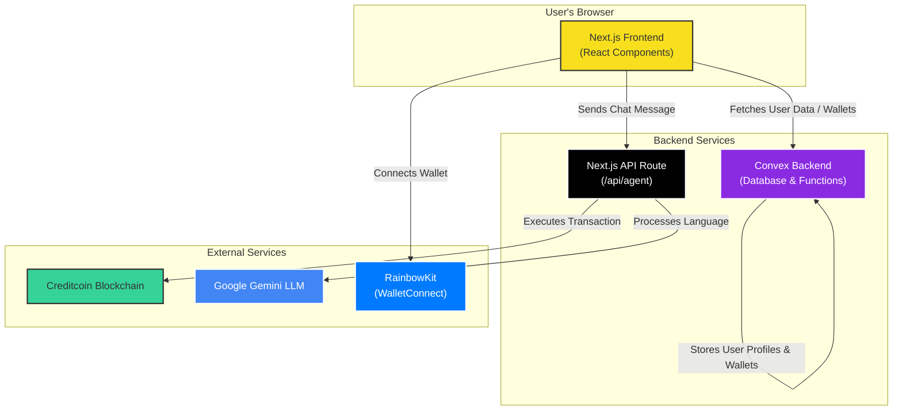

# CredPay | Easy Payments Payments on Creditcoin

CredPay provides a seamless and user-friendly interface for sending and receiving cryptocurrency payments on the Creditcoin network. It features a powerful AI Payment Assistant and secure custodial wallets

---

## ✨ Key Features

- **Instant Payments**: Send and receive `tCTC` on the Creditcoin testnet in seconds.
- **Wallet Integration**: Connect securely with popular wallets like MetaMask and Coinbase Wallet using RainbowKit.
- **Usernames**: Create a unique, human-readable username and receive payments via `credpay.app/pay/your-username`.
- **Payment Links & QR Codes**: Generate shareable payment links and QR codes for easy payment requests.
- **Custodial Wallets**: Create secure, client-side encrypted wallets that can be managed within the app.
- **🤖 AI Payment Assistant**: A powerful, conversational AI agent built with LangChain and Google Gemini that can:
  - Understand natural language commands (e.g., "Send 0.1 tCTC to...").
  - Execute real transactions on the Creditcoin network autonomously.
  - Answer general knowledge questions about cryptocurrency using web search.

---

## Architecture



**Flow Description:**

1.  **Frontend**: The user interacts with the Next.js application in their browser. They connect their primary wallet (e.g., MetaMask) via RainbowKit.
2.  **Convex Backend**: The frontend communicates directly with the Convex backend to fetch and store user profile data, usernames, and encrypted custodial wallet information.
3.  **AI Agent (API Route)**: When the user chats with the AI Payment Assistant, the frontend sends the message to a standalone Next.js API route.
4.  **LLM & Blockchain**: This API route, which runs the LangChain agent, processes the user's request using Google Gemini. If a transaction is required, the agent uses its own dedicated private key to sign and send the transaction directly to the Creditcoin blockchain.

---

## 🚀 Getting Started

Follow these instructions to set up and run the project locally.

### 1. Prerequisites

- [Node.js](https://nodejs.org/en/) (v18.0.0 or higher)
- [npm](https://www.npmjs.com/) or [yarn](https://yarnpkg.com/)
- A cryptocurrency wallet (e.g., MetaMask)

### 2. Clone the Repository

```bash
git clone https://github.com/devesh1011/CredPay.git
cd CredPay
```

### 3. Install Dependencies

```bash
npm install
```

### 4. Set Up Environment Variables

Create a `.env.local` file in the root of the project by copying the example file:

```bash
cp .env.example .env
```

Now, open `.env.local` and fill in the required values.

```env
# Convex Backend (Get from your Convex project dashboard)
NEXT_PUBLIC_CONVEX_URL="https://your-project.convex.cloud"
CONVEX_DEPLOYMENT="dev:your-project-name"

# RainbowKit Wallet Connection (Get from WalletConnect Cloud)
NEXT_PUBLIC_WALLETCONNECT_PROJECT_ID="your-walletconnect-project-id"

# Google API Key (For the AI Agent)
GOOGLE_API_KEY="your-google-api-key"

# Creditcoin Agent Wallet Configuration
CREDITCOIN_RPC_URL="https://rpc.testnet.creditcoin.network"
# IMPORTANT: This is the private key for the AI agent's own wallet.
# It must be funded with tCTC for the agent to send transactions.
AGENT_PRIVATE_KEY="your-agent-private-key"
```

### 5. Set Up Convex Backend

If you haven't already, you'll need to deploy the Convex backend functions and schema.

```bash
# Log in to Convex
npx convex login

# Deploy the backend
npx convex deploy
```

### 6. Run the Development Server

```bash
npm run dev
```

The application should now be running at [http://localhost:3000](http://localhost:3000).

---

## 📄 License

This project is licensed under the MIT License - see the [LICENSE](LICENSE) file for details.
